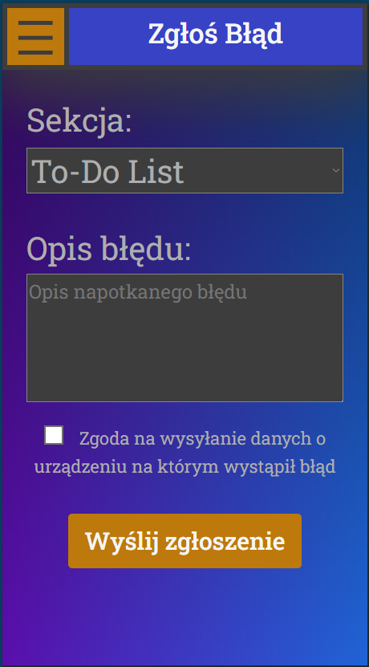

#  ListIt
Jest to nowoczesna platforma internetowa służąca do zarządzania wydarzeniami akademickimi. <br>
Składa się z trzech interfejsów użytkownika – dla studentów, pracowników uczelni oraz administratora – a także backendu i bazy danych. <br>
Aplikacja zapewnia sprawny przepływ informacji między studentami a pracownikami uczelni, umożliwiając łatwą organizację i interakcję wokół akademickich wydarzeń. <br>
Dzięki systemowi moderacji administrator dba o jakość publikowanych treści i sprawne działanie platformy.

<br>
<br>

# Funkcjonalności pracowników uczelni:
1. Pracownicy z założenia logują się, rejestrują się oraz korzystają tylko z komputerowej wersji strony internetowej: <br><br>
    
    
    
   <br><br>
2. Zmiana opisu konta: <br><br>
   <br><br>
3. Zmiana zdjęcia profilowego (tak samo jak u administratora po kliknieciu w zdjęcie profilowe): <br><br>
   <br><br>
4. Dodawanie nowych wydarzeń, które odbędą się na uczelni: <br><br>
   
   
   <br><br>
5. Edycja i aktualizacja informacji o wydarzeniach: <br><br>
   <br><br>
6. Usuwanie dodanych wydarzeń (wraz z potwierdzeniem): <br><br>
   <br><br>
7. Wygodne przeglądanie dodanych wydarzeń: <br><br>
   <br><br>


# Funkcjonalności informatyka (administratora):
1. Administrator z założenia loguje się oraz korzysta tylko z komputerowej wersji strony internetowej: <br><br>
     <br><br>
2. Przeglądanie, sortowanie i zarządzanie użytkownikami: <br><br>
     <br><br>
    Dla przykładu sortowanie rosnąco i malejąco po kolumnie *Indeks*: <br><br>
&nbsp;&nbsp;&nbsp;&nbsp;&nbsp;&nbsp; <br><br>
3. Przeglądanie, sortowanie i zarządanie  wydarzeniami dodanymi przez pracowników (dopiero zaakceptowane wydarzenia pojawią się w aplikacji studentów): <br><br>
     <br><br>
    Po dodaniu wydarzeń przez pracownika:<br><br>
     <br><br>
    Lista rozwijana dla statusu dla każdego wydarzenia: <br><br>
   
     <br><br>
5. Przeglądanie, sortowanie i zarządzanie zgłoszeniami błędów: <br><br>
     <br><br>


# Funkcjonalności studentów (użytkowników):
1. Użytkownicy z założenia głównie mają dostęp do mobilnej wersji strony internetowej, ale nic nie stoi na przeszkodzie aby włączyć ją w wersji na komputer.
2. Ekran logowania/rejestracji: <br><br>
      <br><br>
3. Przechodzenie między kolejnymi częściami aplikacji dzięki rozwijanemu menu w lewym górnym rogu ekranu: <br><br>
     <br><br>
4. Przegladanie, komentowanie i polubianie wydarzeń: <br><br>
    &nbsp;&nbsp;&nbsp;&nbsp;&nbsp;&nbsp;&nbsp;&nbsp;&nbsp;&nbsp;&nbsp;&nbsp;<br><br>
5. Prywatna lista zadań do wykonania (to-do list), możliwość dodawania, usuwania i odznaczania wykonanych zadań: <br><br>
     &nbsp;&nbsp;&nbsp;&nbsp;&nbsp;&nbsp;<br><br>
     Dodawanie nowego zadania (klikamy przycisk `+` w prawym górnym rogu): <br><br>
     <br><br>
     Usuwanie zadań (klikamy przycisk `-` w prawym górnych rogu żeby wejść w tryb zaznaczania, a następnie potwierdzamy usunięcie tym samym przyciskiem): <br><br>
     <br><br>
6. Zakładka ustawienia i możliwość zarządzania swoją platformą: <br><br>
    <br><br>
    Tryb ciemny całej platformy:<br><br>
   &nbsp;&nbsp;&nbsp;&nbsp;&nbsp;&nbsp;&nbsp;&nbsp;&nbsp;&nbsp;&nbsp;&nbsp;<br><br>
    Zmiana hasła do konta:<br><br>
    <br><br>
    Powiadomienie potwierdzające zmianę hasła:<br><br>
    <br><br>
    Możliwość wylogowania się wraz z potwierdzeniem:<br><br>
    <br><br>
7. Możliwość zgłaszania błędów występujących w aplikacji:<br><br>
    <br><br>


# Instalacja i wdrożenie platformy:
## Potrzebne Technologie i aplikacje:

[Java v21](https://www.oracle.com/java/technologies/javase/jdk21-archive-downloads.html) &nbsp;&nbsp; //dodać do PATH

[NodeJS v20.12.1](https://nodejs.org/en/blog/release/v20.12.1) &nbsp;&nbsp; //dodać do PATH

[Postgresql](https://www.postgresql.org/download/)

[pgAdmin 4](https://www.pgadmin.org/download/pgadmin-4-windows/)

<br>

## Kolejność działań:

1. pgAdmin 4

    - włącz pgAdmin 4 i utwórz bazę `List_It`

    - w pliku `List_It\backend\list_it\src\main\resources\application.properties` zmień na własne hasło i login utworzone podczas instalacji pgAdmin (użytkownik postgres) 

```
spring.datasource.username=postgres

spring.datasource.password=[hasło]
```

<br>

2. cmd (uruchomione jako administrator)

```
winget install Chocolatey.Chocolatey
```

> [!IMPORTANT]
> Teraz zrestartuj cmd

```
choco install maven -y
```

<br>

## Uruchamianie aplikacji:

### Włączenie Back-endu:

1. Przejdź do folderu [path\to\project]\List_It\backend\list_it\

2. Uruchom plik `launch_backend.bat`

> [!IMPORTANT]
> Po uruchomieniu pliku `launch_backend.bat` w konsoli wykonają się kolejne polecenia. Gdy już nic więcej nie będzie sie wykonywało back-end jest gotowy i możemy przejść do włączenia front-endu (pozostaw tą konsole włączoną).

<br>

### Włączenie Front-endu:

**Przy użyciu eksplolatora plików:**

1. Przejdź do List_It, a następnie do folderu aplikacji użytkownika, administratora lub pracownika

2. Uruchom plik `launch_app.bat`

3. Wejdź w link `http://localhost:xxxx/` (x - cyfry portu)

<br>

**Przy użyciu cmd lub terminala w dowolnym Idle (np. Visual Studio Code):**

1. Przejdź do List_It a następnie do folderu aplikacji użytkownika, administratora lub pracownika w następujący sposób:

```
cd aplikacja_pracownika
```

2. Wykonaj następujące polecenie:
```
launch_app.bat
```

3. Wejdź w link `http://localhost:xxxx/` (x - cyfry portu)

<br>

## Błędy:

- Jeśli pojawił się błąd związany z ***Java*** (np. *JDK wasn't found*) to upewnij się, że folder w którym zainstalowana została ***Java*** jest dodany do PATH (folder /bin)
- Jeśli pojawił się błąd związany z poleceniem `npm` to upewnij się, że folder w którym zainstowany jest ***Node.js*** jest dodany do PATH (folder /bin)
- Jeśli po kliknięciu przycisku 'Log in' na stronie logowania nic się nie dzieje to znaczy, że baza jest wyłączona albo back-end jest wyłączony. Upewnij się, że po włączeniu back-endu konsola pozostała otwarta oraz że pgAdmin jest włączony.
